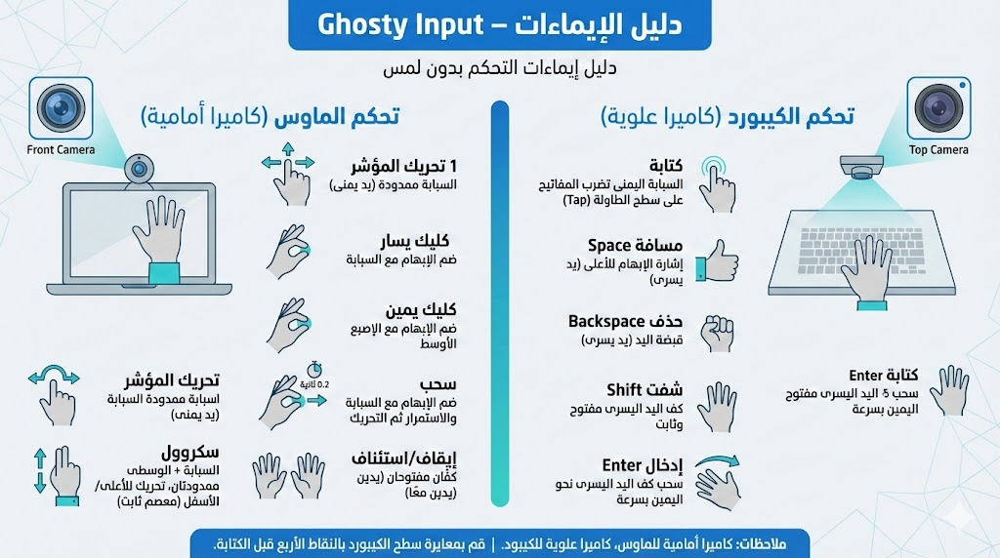

<div align="center">


# Ghosty Input

**التحكم بالماوس ولوحة مفاتيح على الطاولة باستخدام إيماءات اليد**

تطبيق سطح مكتب يعمل بالكامل دون إنترنت، يتيح لك التحكم بالماوس والكتابة على لوحة مفاتيح موضوعة على الطاولة باستخدام إيماءات اليد وتقنيات الرؤية الحاسوبية.

[الموقع](https://imedkablavi.info) ·
[الإصدارات](https://github.com/imedkablavi/ghosty_input/releases) ·
[المشاكل](https://github.com/imedkablavi/ghosty_input/issues) ·
[التوثيق](docs/)

<br/>


<br/><br/>

**اللغة**  
[English](README.md) · [العربية](README.ar.md) · [Türkçe](README.tr.md)

</div>

---

## نظرة عامة

**Ghosty Input** هو تطبيق سطح مكتب يتيح التحكم بالماوس والكتابة على لوحة مفاتيح افتراضية موضوعة على الطاولة باستخدام إيماءات اليد.

- الكاميرا الأمامية مخصّصة للتحكم بالماوس  
- الكاميرا العلوية تُستخدم لمعايرة لوحة المفاتيح  
- يمكن العمل بكاميرا واحدة أو كاميرتين  
- جميع العمليات تتم محليًا دون اتصال بالإنترنت  

---

## المزايا

- بنية تعتمد على كاميرتين  
  - كاميرا أمامية للتحكم بالماوس  
  - كاميرا علوية للوحة المفاتيح
- دعم تلقائي لوضع الكاميرا الواحدة عند الحاجة
- معايرة سطح الطاولة عبر أربع نقاط
- التحكم بالماوس بالإيماءات (تحريك، نقر، سحب، تمرير، إيقاف)
- لوحة مفاتيح افتراضية اختيارية
- إيماءات خاصة باليد اليسرى (مسافة، حذف، شِفت، إدخال)
- حفظ الإعدادات وملفات المستخدم محليًا

---

## دليل الإيماءات

<div align="center">
  
</div>

**ملاحظات**
- الكاميرا الأمامية تتحكم بالماوس
- الكاميرا العلوية تتحكم بلوحة المفاتيح
- الكتابة تتطلب إجراء المعايرة أولًا

---

## صور من التطبيق

### الواجهة الرئيسية
<div align="center">
  
</div>

### لوحة المفاتيح الافتراضية
<div align="center">
  
</div>

---

## التثبيت

### للمستخدمين (موصى به)

#### مثبت ويندوز
1. انتقل إلى صفحة **Releases**
2. حمّل ملف **GhostyInputSetup.exe**
3. ثبّت التطبيق ثم شغّله

لا حاجة لتثبيت Python أو أدوات تطوير.

#### النسخة المحمولة
- حمّل ملف ZIP
- فك الضغط ثم شغّل `GhostyInput.exe`

---

### للمطورين

```bash
git clone https://github.com/imedkablavi/ghosty_input.git
cd ghosty_input
python -m venv .venv
source .venv/bin/activate
pip install -r requirements.txt
python run.py
يتطلب Python 3.10 أو 3.11.

أوضاع الكاميرا
كاميرا واحدة: يتم استخدام بث واحد مشترك للماوس ولوحة المفاتيح

كاميرتان: الكاميرا الأمامية للماوس، والعلوية للوحة المفاتيح

اختفاء المعاينة الثانية أمر طبيعي عند استخدام كاميرا واحدة.

الملفات والسجلات
Windows: %APPDATA%\GhostyInput

Linux: ~/.local/share/GhostyInput

استكشاف الأخطاء
شاشة سوداء: تحقق من رقم الكاميرا أو أذونات الخصوصية

لوحة المفاتيح لا تعمل: تأكد من إجراء المعايرة

أخطاء MediaPipe: استخدم Python 3.10 أو 3.11 فقط

الخصوصية
يعمل Ghosty Input دون اتصال بالإنترنت.
لا يتم إرسال أو تخزين أي بيانات للمستخدم.
```


  ## 💰 You can help me by Donating
  [](https://buymeacoffee.com/imed_kablavi) 
