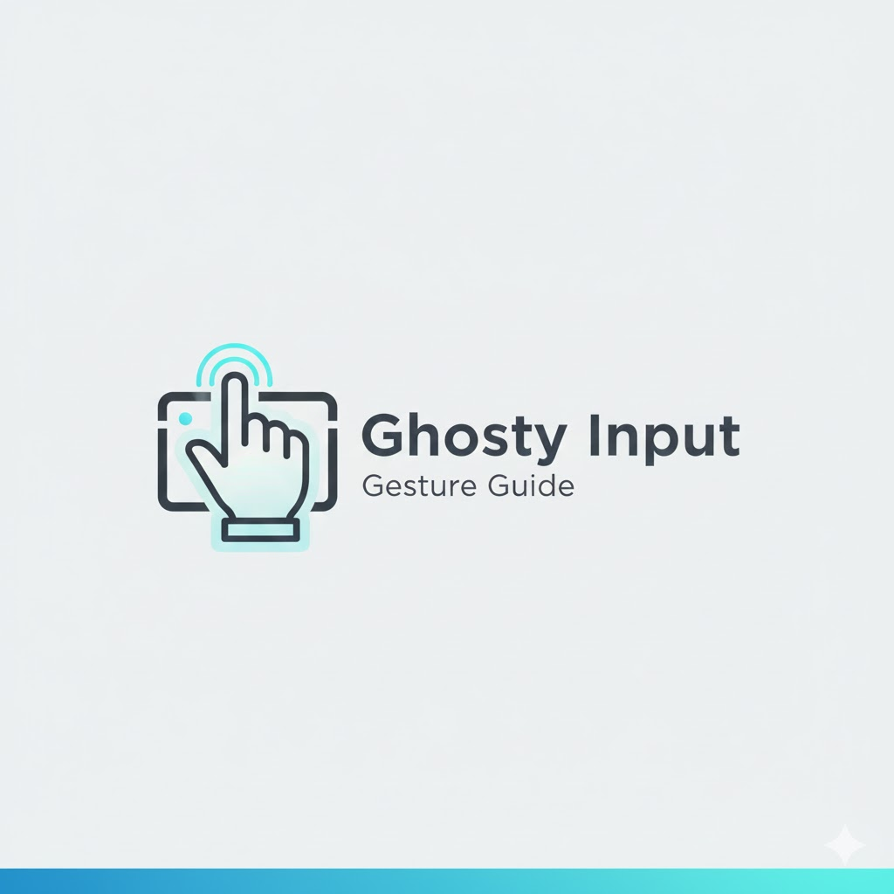

<div align="center">



# Ghosty Input

**تحكم دقيق بالماوس ولوحة مفاتيح على سطح الطاولة باستخدام رؤية حاسوبية محلية**

[English](README.md) · [Türkçe](README.tr.md) · [المعمارية](docs/ARCHITECTURE.md) · [اختبارات الجودة](docs/QUALITY.md) · [الخصوصية](PRIVACY.md)

</div>

يركّز إصدار 0.3 على تحويل المشروع من Prototype إلى قاعدة أقرب لمنتج فعلي: ثبات أعلى للتتبع، كتابة أدق، معايرة قابلة للقياس، ولوحة تحكم تسمح بضبط النظام حسب الكاميرا بدل الاعتماد على قيم ثابتة.

## تحسينات الدقة

- طلب 1080p/30 افتراضيًا مع خيارات 720p و1080p و1440p
- عرض الدقة وFPS الفعليين اللذين أعادتهما الكاميرا
- تنعيم زمني لنقاط اليد
- فلتر حركة تكيفي للمؤشر يقلل الاهتزاز عند الثبات ويحافظ على سرعة الاستجابة أثناء الحركة
- Dead-zone لمنع اهتزاز المؤشر بحركات صغيرة جدًا
- حساب Pinch كنسبة إلى حجم كف اليد، لذلك تقل حساسية النظام لتغيّر المسافة عن الكاميرا
- Hysteresis للنقر والسحب والكتابة لمنع التذبذب حول Threshold
- Dwell قصير قبل قبول المفتاح
- Release guard يمنع تكرار نفس الحرف عند إبقاء اليد في وضع Pinch
- هامش أمان داخل حدود المفاتيح لتقليل الضغط على المفتاح المجاور
- فحص هندسي لمعايرة النقاط الأربع مع Quality Score من 0 إلى 100
- رسم لوحة المفاتيح داخل المنظور الحقيقي للمساحة المعايرة
- تشغيل الكاميرا وMediaPipe في Thread منفصل عن واجهة Qt لمنع تجمّد لوحة التحكم

## لوحة التحكم

تحتوي الواجهة الجديدة على:

- معاينة مباشرة للكاميرا الأمامية وكاميرا لوحة المفاتيح
- FPS الفعلي، دقة الكاميرا، ثقة تتبع اليد، وجودة المعايرة
- Profiles: Balanced وPrecision وPerformance
- إعداد الدقة وFPS
- ضبط Detection وTracking confidence
- ضبط تنعيم المؤشر وحساسية Pinch
- ضبط زمن ثبات المفتاح وRelease guard
- Workflow واضح لمعايرة أربع نقاط
- سجل تشخيص Runtime
- حفظ الإعدادات محليًا

## أفضل إعداد للكتابة

يفضّل استخدام كاميرا علوية مستقلة ومثبتة فوق مساحة لوحة المفاتيح. بعد تشغيل التطبيق:

1. فعّل كاميرا الطاولة المنفصلة.
2. افتح **Calibration**.
3. ابدأ معايرة النقاط الأربع.
4. من معاينة الطاولة اضغط: أعلى يسار → أعلى يمين → أسفل يمين → أسفل يسار.
5. تأكد أن خطوط المفاتيح المسقطة تتطابق مع المساحة الفعلية.
6. حرّك سبابة اليد اليمنى فوق المفتاح ثم نفّذ Pinch بالإبهام والسبابة.

## المتطلبات

- Python 3.10 أو 3.11
- Windows أو Linux
- كاميرا واحدة على الأقل، وكاميرتان موصى بهما للكتابة
- صلاحية الوصول إلى الكاميرا

قد لا تقبل بعض الكاميرات الدقة أو FPS المطلوبين. لذلك تعرض الواجهة القيم الفعلية بدل افتراض نجاح الإعداد.

## التشغيل من المصدر

```bash
git clone https://github.com/imedkablavi/ghosty_input.git
cd ghosty_input
python -m venv .venv
```

Linux:

```bash
source .venv/bin/activate
pip install -r requirements.txt
python run.py
```

Windows PowerShell:

```powershell
.\.venv\Scripts\Activate.ps1
pip install -r requirements.txt
python run.py
```

## الجودة قبل الإصدار

الاختبارات الآلية لا تكفي لمنتج يعتمد على الكاميرا. يوجد Checklist لاختبار الدقة والكتابة والاستقرار على أجهزة فعلية في [docs/QUALITY.md](docs/QUALITY.md).

## الخصوصية

المعالجة محلية داخل الذاكرة، ولا يتضمن التطبيق Telemetry أو Analytics أو Cloud inference. راجع [PRIVACY.md](PRIVACY.md).

## الدعم

[](https://buymeacoffee.com/imed_kablavi)
