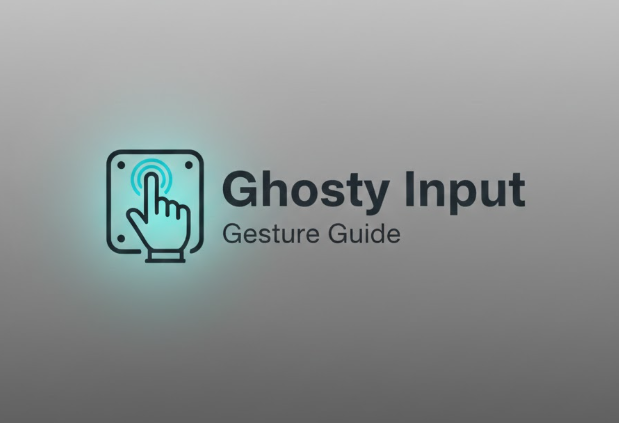

<div align="center">



# Ghosty Input

**Hand-gesture mouse control and desk-surface virtual keyboard**

Local, offline hand-tracking system for mouse control and desk-based typing using computer vision.

[Website](https://imedkablavi.info) ·
[Releases](https://github.com/ghosty_input/releases) ·
[Issues](https://github.com/ghosty_input/issues) ·
[Documentation](docs/)

<br/>

<!-- Badges -->


<br/><br/>

**Language:**  
[English](README.md) · [العربية](README.ar.md) · [Türkçe](README.tr.md)

</div>

---

## Overview

**Ghosty Input** is a desktop application that allows users to control the mouse and type on a desk-surface virtual keyboard using hand gestures.

The system supports one or two cameras and automatically optimizes camera usage to avoid duplicated streams and performance issues.

All processing is performed locally. No network connection is required.

---

## Features

- Dual-camera architecture  
  - Front camera for mouse control  
  - Top-down camera for desk-plane keyboard
- Automatic single-camera fallback (shared stream)
- Desk-plane calibration using four points (homography)
- Gesture-based mouse interaction: move, click, drag, scroll, pause
- Desk-surface virtual keyboard with optional overlay
- Left-hand modifier gestures (Space, Backspace, Shift, Enter)
- Local user profiles and configuration

---

## Screenshots

### Main Dashboard


### Desk Plane Calibration


### Virtual Keyboard Overlay


---

## Installation

### For Regular Users (Recommended)

#### Windows Installer
1. Go to **Releases**
2. Download **GhostyInputSetup.exe**
3. Run the installer and launch the application

This option does not require Python or development tools.

#### Windows Portable
- Download the portable ZIP
- Extract and run `GhostyInput.exe`

---

### For Developers

Clone the repository and run from source:

```bash
git clone https://github.com/YOUR_REPO.git
cd GhostyInput
python -m venv .venv
source .venv/bin/activate   # Windows: .\.venv\Scripts\activate
pip install -r requirements.txt
python run.py
