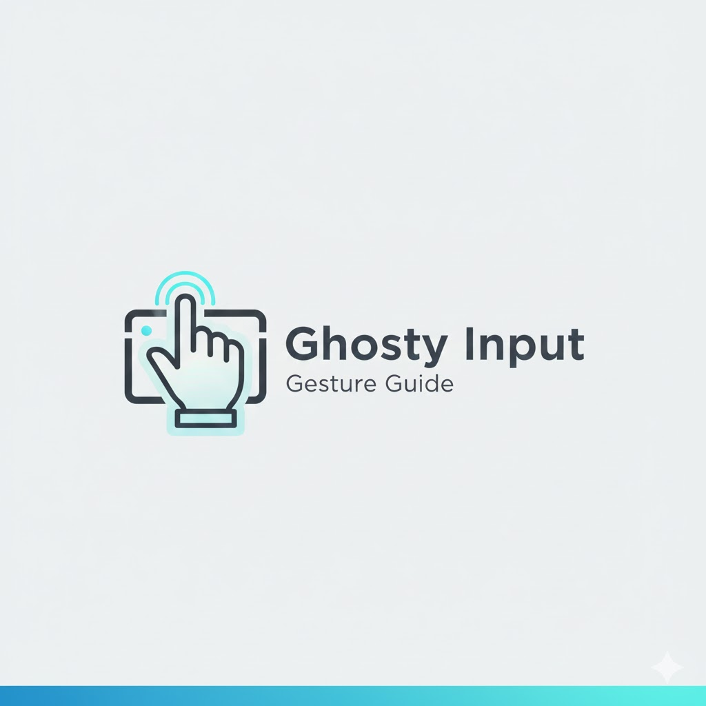
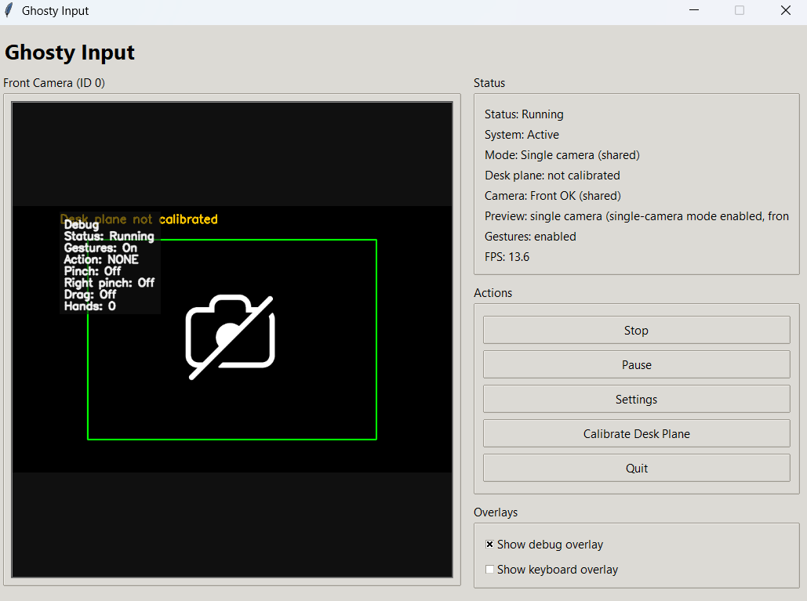
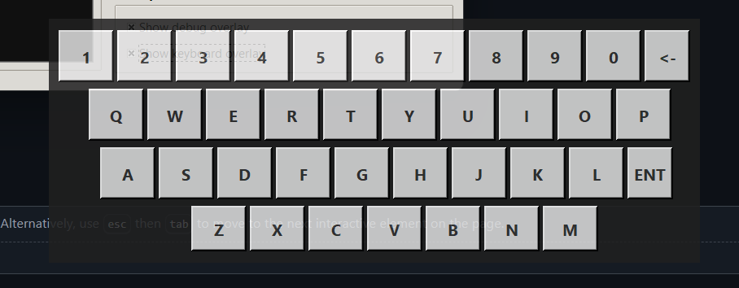

<div align="center">



# Ghosty Input

**Hand-gesture mouse control and desk-surface virtual keyboard**

Local, offline hand-tracking system for mouse control and desk-based typing using computer vision.

[Website](https://imedkablavi.info) ·
[Releases](https://github.com/imedkablavi/ghosty_input/releases) ·
[Issues](https://github.com/imedkablavi/ghosty_input/issues) ·
[Docs](docs/)

<br/>


<br/><br/>

**Language**  
[English](README.md) · [العربية](README.ar.md) · [Türkçe](README.tr.md)

</div>

---

## Overview

**Ghosty Input** is a desktop application that allows users to control the mouse and type on a desk-surface virtual keyboard using hand gestures.

- Front camera controls the mouse  
- Top-down camera maps a physical desk keyboard  
- One-camera or two-camera setups are supported  
- All processing runs locally (offline)

---

## Features

- Dual-camera architecture  
  - Front camera → mouse control  
  - Top camera → desk keyboard
- Automatic single-camera fallback (shared stream)
- Desk-plane calibration using four corner points
- Gesture-based mouse interaction (move, click, drag, scroll, pause)
- Desk-surface virtual keyboard with optional overlay
- Left-hand modifier gestures (Space, Backspace, Shift, Enter)
- Local profiles and configuration

---

## Gesture Guide

<div align="center">
  
</div>

**Notes**
- Front camera is used for mouse control
- Top-down camera is used for desk-surface keyboard input
- Keyboard typing requires desk-plane calibration (4 points)

---

## Screenshots

### Main Dashboard
<div align="center">
  
</div>

### Desk Plane Calibration
<div align="center">
  
</div>

### Virtual Keyboard Overlay
<div align="center">
  
</div>

---

## Installation

### For Regular Users (Recommended)

#### Windows Installer
1. Open the **Releases** page
2. Download **GhostyInputSetup.exe**
3. Install and launch the application

No Python or development tools are required.

#### Windows Portable
- Download the portable ZIP
- Extract and run `GhostyInput.exe`

---

### For Developers

Clone the repository and run from source:

```bash
git clone https://github.com/imedkablavi/ghosty_input.git
cd ghosty_input
python -m venv .venv
source .venv/bin/activate   # Windows: .\.venv\Scripts\activate
pip install -r requirements.txt
python run.py
Python 3.10 or 3.11 is required.

Camera Modes
Single camera: one shared stream for mouse and keyboard

Two cameras: front camera for mouse, top camera for keyboard

If only one camera preview is visible, this is expected behavior.

Profiles & Logs
User data is stored outside the installation directory.

Windows: %APPDATA%\GhostyInput

Linux: ~/.local/share/GhostyInput

Troubleshooting
Black camera preview: camera ID may be incorrect or blocked by OS privacy settings

Second camera preview hidden: expected in single-camera mode

Keyboard not typing: desk-plane calibration is required

MediaPipe errors: use Python 3.10 or 3.11 only

Privacy
Ghosty Input works fully offline.
No camera data or user input is transmitted or collected.

See PRIVACY.md
