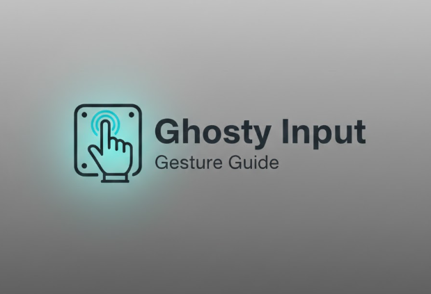

<div align="center">



# Ghosty Input

**Offline hand-gesture mouse control and desk-surface virtual keyboard**

[العربية](README.ar.md) · [Türkçe](README.tr.md) · [Architecture](docs/ARCHITECTURE.md) · [Privacy](PRIVACY.md)

</div>

Ghosty Input turns one or two ordinary cameras into a touch-free desktop input system. A front-facing camera tracks hand gestures for pointer control, while an optional top-down camera maps a calibrated desk area to a virtual QWERTY keyboard.

## What is included

- Right-hand pointer movement with smoothing
- Thumb/index pinch for left click
- Thumb/middle pinch for right click
- Thumb/ring pinch-and-hold for drag
- Two-finger vertical gesture for scrolling
- Hold a fist for 0.75 seconds to pause/resume pointer control
- Single-camera and dual-camera modes
- Four-corner desk-plane calibration using a perspective transform
- QWERTY desk keyboard with visual overlay
- Left-hand modifier shortcuts
- Local settings and calibration persistence
- Qt desktop dashboard with live camera previews
- Windows and Linux source support
- Windows portable build workflow
- Automated tests and linting
- No telemetry and no runtime network dependency

## Requirements

- Python 3.10 or 3.11
- A webcam; two cameras are recommended for desk keyboard mode
- Windows or Linux desktop session
- Camera permission
- On Linux, a desktop environment where PyAutoGUI can generate input events

## Install from source

```bash
git clone https://github.com/imedkablavi/ghosty_input.git
cd ghosty_input

python -m venv .venv
```

Linux:

```bash
source .venv/bin/activate
pip install -r requirements.txt
python run.py
```

Windows PowerShell:

```powershell
.\.venv\Scripts\Activate.ps1
pip install -r requirements.txt
python run.py
```

## First run

1. Select the front camera index.
2. Enable **Use separate top camera** if you have a second camera.
3. Start the runtime.
4. If desk keyboard mode is enabled, click **Calibrate desk**.
5. On the desk preview, click: top-left → top-right → bottom-right → bottom-left.
6. Hover a key with the right index fingertip and pinch thumb + index to type.

Calibration remains valid until the camera or desk position changes.

## Mouse gestures

| Gesture | Action |
|---|---|
| Move right index fingertip | Move pointer |
| Thumb + index pinch | Left click |
| Thumb + middle pinch | Right click |
| Thumb + ring pinch/hold | Drag |
| Index + middle raised, vertical motion | Scroll |
| Closed fist held 0.75s | Pause/resume |

## Left-hand keyboard modifiers

When desk keyboard mode is active, the left hand can trigger modifiers by the number of raised non-thumb fingers:

| Fingers | Action |
|---:|---|
| 1 | Shift |
| 2 | Backspace |
| 3 | Enter |
| 4 | Space |

## Local data

Settings are stored outside the repository:

- Windows: `%APPDATA%\GhostyInput\config.json`
- Linux: `~/.local/share/GhostyInput/config.json`

No camera frame or typed content is saved by Ghosty Input.

## Development

```bash
pip install -r requirements-ci.txt
ruff check .
pytest
```

The CI workflow runs linting and tests on Python 3.10 and 3.11 on both Ubuntu and Windows.

## Windows portable build

Run the **Build Windows Portable** workflow from GitHub Actions, or push a tag such as `v0.2.0`. The workflow packages the application with PyInstaller and uploads the result as an artifact.

## Current status

This repository is a from-scratch rebuild based on the surviving project specification and assets. The core runtime, calibration, input mapping, Qt dashboard, tests and packaging workflow are implemented. Gesture thresholds can still require tuning for individual cameras, lighting conditions and hand distance.

## Privacy

Ghosty Input processes frames locally in memory and does not include analytics, telemetry or cloud APIs. See [PRIVACY.md](PRIVACY.md).

## Author

iEmmAd / cybrex - [@imedkablavi](https://github.com/imedkablavi)

## Support

[](https://buymeacoffee.com/imed_kablavi)
